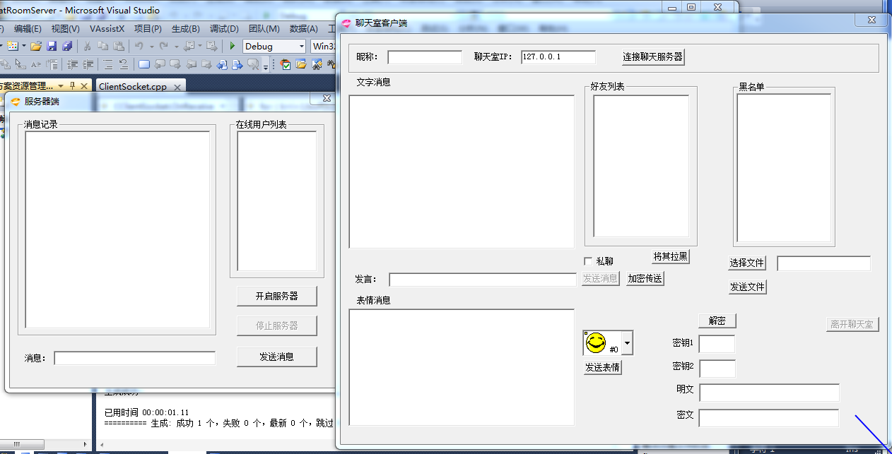

ui：
VC++ ChatRoom聊天室(客户端+服务端)
VC++ 聊天室(客户端+服务端)，CS架构的ChatRoom聊天源码，服务端用来创建公共的聊天服务，比如创建用户列表、显示聊天消息、监控用户数量和在线人数；客户端是提供给用户使用的真正聊天程序，可完成大部分的聊天操作，比如发送聊天内容、选择私聊对象、查看聊天黑名单、设置加密传输消息、设置加密密钥、密文、选择发送表情、自定义昵称等功能。聊天窗口通过调主对话框的成员函数GetMessage来显示聊天信息，当用户数增加时，播放欢迎音乐，当用户数减少时播放离开音乐。 
　　源代码部分，请参照源码目录中命名的文件夹，查看对应功能。
